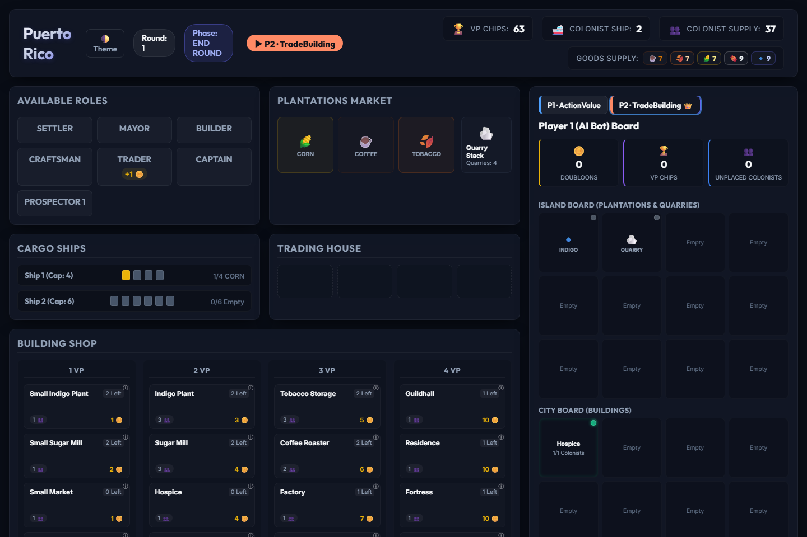

# Puerto Rico AI Competition

[](https://github.com/dae-hany/PuertoRico_AI_Competition/actions/workflows/tests.yml)
[](https://colab.research.google.com/github/dae-hany/PuertoRico_AI_Competition/blob/main/examples/first_agent.ipynb)

An AI competition built on **Puerto Rico**, an economic strategy board game
proposed as a reinforcement-learning / game-AI benchmark. You write an agent,
it plays full games against other agents, and a tournament ranks everyone.

The competition runs in **two independent tracks**, each with its own leaderboard:

- **2p track** — 1-vs-1 (2-player) Puerto Rico.
- **3p track** — 3-player Puerto Rico.

You may enter **either track or both**; each track is a **separate submission**
(among other things, the observation length differs — 220 in 2p, 293 in 3p). The
rules, engine, and action space are otherwise shared.

This repository is used for the **IEEE CoG 2027 competition** and as the final
project of a university **Game AI** course (identical rules). Everything — the
engine, the agents, the docs — is in English so anyone can take part. The engine
is a standard [PettingZoo](https://pettingzoo.farama.org/) AEC environment
(`puerto_rico/env.py`), so multi-agent RL tooling can drive it directly.

**New here?** The fastest start is the notebook
[`examples/first_agent.ipynb`](examples/first_agent.ipynb) (open it in Colab
with the badge above): write an agent, play it against the baselines, and
replay a game, in about ten minutes and with nothing installed.

> Why a competition? Puerto Rico is easy to simulate but hard to master, and it is
> *hard for plain reinforcement learning*: hand-written heuristics and tree search
> still beat trained RL agents. Building something that beats them is the challenge.



## Quickstart

```bash
git clone https://github.com/dae-hany/PuertoRico_AI_Competition.git
cd PuertoRico_AI_Competition
python -m venv .venv && . .venv/bin/activate     # Windows: .venv\Scripts\activate
pip install -e .                        # installs deps + makes the packages importable
pip install -e ".[webui]"               # optional: flask, for the browser UI
pip install -e ".[rl]"                  # optional: PyTorch, for the PPO baseline

python examples/play_one_game.py        # one baseline game per track (2p and 3p)
python tools/play.py --agent submissions/example_agent.py:ExampleAgent   # an agent vs the baselines
python tools/validate_submission.py submissions/example_agent.py         # the official sandbox check
python examples/run_tournament.py       # a round-robin + leaderboard for each track
python webui/server.py                  # browser UI: play / watch / debug (webui extra)
# then open http://127.0.0.1:5000/?players=2&seats=actionvalue,trade to watch two bots play
```

`pip install -e .` is recommended (it makes `agents`, `tournament`, `puerto_rico`
importable from anywhere). `pip install -r requirements.txt` also works — the
example scripts add the repo root to the path themselves, but you should then run
them from the repo root.

## Write an agent

Subclass `Agent` and implement one method:

```python
import numpy as np
from agents.base import Agent

class MyAgent(Agent):
    name = "MyAgent"

    def act(self, observation, action_mask):
        # observation: float32[220] in 2p / [293] in 3p  |  action_mask: int[200] (1 = legal)
        legal = np.where(action_mask > 0.5)[0]
        return int(legal[0])            # replace with your strategy
```

The action space is identical in both tracks; only the observation length differs
(`len(observation)` tells you which track you are in). Agents that read the mask
or the `forward_model` — like every baseline below except PPO — work in both.

Copy [`submission_template/`](submission_template/) to get started, then read the
[Submission guide](docs/SUBMISSION_GUIDE.md).

## Test and validate your agent

```bash
python tools/play.py --agent my_agent.py:MyAgent                        # vs ActionValue and TradeBuilding
python tools/play.py --agent my_agent.py:MyAgent --vs Search --games 20 # win rate, VP margin, ms per move
python tools/play.py --agent my_agent.py:MyAgent --players 3 --vs all --record
python tools/validate_submission.py my_agent.py:MyAgent                 # plays inside the official sandbox
```

`play.py` plays seat-rotated games under the competition rules and prints, per
opponent, your win rate, mean VP margin, and per-move time, so you can see how
close to the 1 s budget you are. `validate_submission.py` runs your file the way
the official run does — its own process, killed at the deadline — and prints a
PASS / WARN / FAIL checklist (imports, name, timeouts, illegal moves) with exit
status 0 when the entry is ready. Any recorded game (`--record`, or every game
played in the web UI) replays move by move with `tools/replay_game.py`.

## Baselines

| Agent | Type | Track |
|---|---|---|
| `SearchAgent` | alpha‑beta search, 1500‑node budget | 2p (reactive fallback in 3p) |
| `SearchLiteAgent` | the same search, 250‑node budget | 2p (reactive fallback in 3p) |
| `PpoAgent` | PPO self-play (RL) | 3p — the bundled checkpoint is 293‑dim |
| `MctsAgent` | Max^N UCT tree search, 60 simulations | both |
| `ActionValueAgent` | greedy heuristic — scores each legal action, plays the best | both |
| `ShippingRushAgent` | shipping-focused heuristic | both |
| `TradeBuildingAgent` | trade → building heuristic | both |
| `FactoryAgent` | Factory-engine heuristic | both |
| `RandomAgent` | uniform random legal move | both |

**How strong is each one? → [`docs/BASELINES.md`](docs/BASELINES.md)**, measured
rather than asserted, and regenerated by `python tools/measure_baselines.py`.
The short version: **`Search` tops the 2p track** (100% against every heuristic
but `Factory`) and **`PPO` tops the 3p track** (83–100%). Among the heuristics
the ordering *differs between tracks* — `TradeBuilding` leads 1‑vs‑1 while
`ShippingRush` leads 3‑player — which is worth knowing before you tune one agent
for both.

A search agent's strength is only defined at a **stated compute budget**, so the
budgets are quoted with the numbers; `SearchAgent`'s is a node count rather than
a clock, so it plays the same move on any hardware.

The heuristic baselines are player-count-agnostic, and so is `MctsAgent` (its
Max^N value vectors are sized from the game it is handed). `SearchAgent` /
`SearchLiteAgent` search the 1‑vs‑1 game and fall back to a reactive heuristic in
a 3p game. The trainer supports both tracks (`--num_players 2`), but only a 3p
checkpoint ships — so the **2p track has no RL baseline**, which is an open
target for entrants.

### Recommended approach for the 2p track

Puerto Rico 1‑vs‑1 is a two-player, winner-takes-all (≈ zero-sum),
**near‑perfect‑information** game (the only hidden state is the face-down
plantation draw order) — exactly where **adversarial search** shines.
`SearchAgent` is a clean, readable alpha‑beta reference you can **play against,
study, and improve**. Its strength is set by a **node budget** (not wall-clock),
so it plays the *same* move on any hardware — fair to compare against. See
**[docs/SEARCH_BASELINE_2P.md](docs/SEARCH_BASELINE_2P.md)** for how it works and
a ranked list of concrete ways to make it stronger (your opportunity as an
entrant).

## Repository layout

```
puerto_rico/        core game engine + environment + forward model
agents/             the Agent interface and all baseline agents
tournament/         single-match harness, round-robin runner, rankers, leaderboard
                    (sandbox.py runs each entrant in its own process — the
                     official run's time limit and anti-tampering guarantees)
training/           optional PPO self-play trainer + the bundled 3p RL checkpoint
webui/              browser UI to play, watch, and debug agents
examples/           first_agent.ipynb (Colab), play_one_game.py, run_tournament.py
tools/              play.py (your agent vs the baselines), validate_submission.py
                    (the official sandbox check), replay_game.py, run_ladder.py
                    (organizer: one ladder round), bench2p.py, bench_engine.py,
                    measure_baselines.py
leaderboard/        ladder standings and replays, published during the window
submission_template/ copy this to build your competition entry
submissions/        drop an agent here to debug it in the web UI
docs/               rules, observation/action encoding, ranking, submission guide
tests/              pytest suite
```

## The competition

- **Format.** Two tracks, 2p and 3p, one agent file per track. Each track is a
  seat-balanced round-robin of every entry against every other entry and the
  bundled baselines, ranked by Elo (2p) or TrueSkill (3p); the rules are in
  [docs/COMPETITION_RULES.md](docs/COMPETITION_RULES.md).
- **Window.** The competition runs for about three months. The dates of the
  IEEE CoG 2027 edition will be announced here.
- **Weekly ladder.** During the window the organizer runs every entry received
  so far (`tools/run_ladder.py`) and publishes the standings **and every game's
  replay** under [`leaderboard/`](leaderboard/). Submit early, watch your rank,
  and resubmit as often as you like; the last file received before the deadline
  is the one that counts.
- **How to submit.** To be announced with the dates. Until then, questions and
  bug reports go to the
  [issue tracker](https://github.com/dae-hany/PuertoRico_AI_Competition/issues).

## How ranking works

**Each track is ranked separately** (its own round-robin and leaderboard). The
official metric is a **skill rating matched to the track** — **Elo** in the 2p
(1‑vs‑1) track, **TrueSkill** in the 3p track — computed over a seat-balanced
round-robin, with **win rate** (Wilson 95% CI) shown alongside. (α‑Rank is
available as opt‑in analysis, not part of the standings.) See
[Ranking](docs/RANKING.md). The **2p‑track** board over the bundled heuristics
(official = **Elo**, win rate alongside), from the 500‑game round-robin in
[`docs/BASELINES.md`](docs/BASELINES.md):

| Rank | Agent | Elo (official) | Win% | 95% CI | Games |
|-----:|-------|---------------:|-----:|:------:|------:|
| 1 | TradeBuilding | 1841 | 81.2% | [0.75, 0.86] | 200 |
| 2 | ActionValue | 1679 | 68.2% | [0.62, 0.74] | 200 |
| 3 | Factory | 1423 | 43.0% | [0.36, 0.50] | 200 |
| 4 | ShippingRush | 1345 | 35.0% | [0.29, 0.42] | 200 |
| 5 | Random | 1211 | 22.5% | [0.17, 0.29] | 200 |

_Numbers vary with the agent pool and number of games. The **3p track** is ranked
by **TrueSkill** instead (win rate alongside), and the ordering really does
differ between tracks: TradeBuilding tops this 1‑vs‑1 board but is only third in
3p, where ShippingRush leads. See [Ranking](docs/RANKING.md) and
[Baselines](docs/BASELINES.md)._

## Documentation

- [Game rules](docs/GAME_RULES.md)
- [Baseline strengths](docs/BASELINES.md) — measured, per track
- [Observation & action encoding](docs/OBSERVATION_AND_ACTIONS.md)
- [Competition rules](docs/COMPETITION_RULES.md)
- [Submission guide](docs/SUBMISSION_GUIDE.md)
- [Ranking](docs/RANKING.md)
- [Changes that affect results](CHANGES.md)

## Tests

```bash
pip install pytest
python -m pytest tests/ -q
```

## License

Code is released under the [MIT License](LICENSE). The board game *Puerto Rico*
(designer Andreas Seyfarth) is the intellectual property of its rights holders;
this is an independent, non-commercial re-implementation for education and
research, with no original artwork. See [LICENSE](LICENSE) for the full notice.
